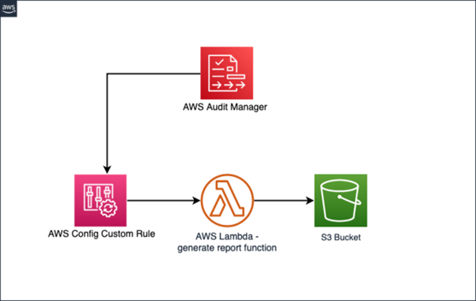

# Generate User Access Privilege Reports with AWS Audit Manager

*By Anu Jayanthi, John Fischer, and Parth Shah | on 14 JUN 2023 | in [Management Tools](https://aws.amazon.com/blogs/mt/category/management-tools/) | [Permalink](https://aws.amazon.com/blogs/mt/generate-user-access-privilege-reports-with-aws-audit-manager/) Permalink | [Share](https://aws.amazon.com/blogs/mt/generate-user-access-privilege-reports-with-aws-audit-manager/)*

Customers adhere to compliance programs and certifications mandated by their business and industry regulations. A key component of achieving compliance is producing a user privilege and access report for their cloud infrastructure.

Auditors use user privilege and access reports to ensure permissions are locked down at a granular level. Access control mechanisms are imposed at different levels (e.g. [Service control policies](https://docs.aws.amazon.com/organizations/latest/userguide/orgs_manage_policies_scps.html), [resource-based policies](https://docs.aws.amazon.com/IAM/latest/UserGuide/access_controlling.html), [user/group/role policy](https://docs.aws.amazon.com/IAM/latest/UserGuide/id.html), [permission boundary](https://docs.aws.amazon.com/IAM/latest/UserGuide/access_policies_boundaries.html), etc.), making it hard to generate a consolidated access report.

This post aims to help you get started on achieving a detailed privilege report using native AWS services and storing the results in [AWS Audit Manager](https://aws.amazon.com/audit-manager/).

[Audit Manager](https://aws.amazon.com/audit-manager/) is a fully-managed service that provides prebuilt frameworks for common industry standards and regulations and automates the continual collection of evidence to help you prepare for an audit. The continuous and automated gathering of evidence related to your [AWS](https://aws.amazon.com/) resource usage helps simplify risk assessment and compliance with regulations and industry standards.

[AWS Config](https://aws.amazon.com/config/) enables customers to evaluate the configuration settings of AWS resources. This is done by AWS Config rules, which evaluate the current state against the desired state. Customers can use AWS-managed rules or custom rules. You can use Audit Manager to capture AWS Config evaluations as evidence for audits. When you create or edit a custom control, you can specify one or more AWS Config rules as a data source for evidence collection.

[AWS Identity and Access Management (IAM)](https://aws.amazon.com/iam/) helps specify who or what can access services and resources in AWS, centrally manage fine-grained permissions, and analyze access to refine permissions across AWS.

[Service control policies (SCPs)](https://docs.aws.amazon.com/organizations/latest/userguide/orgs_manage_policies_scps.html) are a type of organization policy that you can use to manage permissions in your organization. SCPs offer central control over the maximum available permissions for all accounts in your organization.

## Overview of Solution

We demonstrate how to create an [AWS Config Custom Rule](https://docs.aws.amazon.com/config/latest/developerguide/evaluate-config_develop-rules.html) which gathers configuration evidence automatically, stores them in [Amazon Simple Storage Service (Amazon S3)](https://aws.amazon.com/s3/), and provides the link to the evidence with the [AWS Audit Manager assessment report](https://docs.aws.amazon.com/audit-manager/latest/userguide/assessment-reports.html). Using this solution, customers can automate the process of generating custom reports and reduce the manual effort of importing evidence to their Audit Manager assessments.
We use [AWS Lambda ](https://aws.amazon.com/lambda/) backed [AWS Config Custom Rules](https://docs.aws.amazon.com/config/latest/developerguide/evaluate-config_develop-rules.html) to extend AWS Config and collect configuration evidence for IAM Users/Groups. This evidence will be stored in Amazon S3 and referenced as part of your AWS Audit Manager custom assessment report.

In this post we will cover:
<ol type="a">
  <li>Setting up Audit Manager Custom Assessment.</li>
  <li>
    Setting up Custom Rules for AWS Config using AWS Config Custom Lambda Rules:
    
- Use AWS Lambda to Generate policy report for IAM Users (includes AWS Managed, in-line policies and policies attached to assigned groups).
</li>
</ol>

### Prerequisites:
   - An S3 bucket to which the AWS Config custom rule can write evidence.
   - AWS Config must be enabled and have an AWS Config Recorder (Refer to [Setting Up AWS Config with the Console](https://docs.aws.amazon.com/config/latest/developerguide/gs-console.html)).
   - Permissions to deploy the provided [AWS CloudFormation template](https://aws.amazon.com/cloudformation/). Sample permissions can be reviewed under [Controlling access with AWS Identity and Access Management](https://docs.aws.amazon.com/AWSCloudFormation/latest/UserGuide/using-iam-template.html).
   - AWS Audit Manager must be enabled ([Setup AWS Audit Manager](https://docs.aws.amazon.com/audit-manager/latest/userguide/setting-up.html)).
   - Permissions to access AWS Config, AWS Audit Manager, IAM users/groups, and their associated policies.
   - An [AWS Cloud9 instance](https://aws.amazon.com/cloud9/).
## Deployment Steps

**Step 1**: Login to AWS Console and navigate to AWS Cloud9 IDE.

**Step 2**: Fo
okllow Instructions to Setup [AWS Cloud9 Environment](https://docs.aws.amazon.com/cloud9/latest/user-guide/create-environment-main.html) EC2. (Make sure to Select the Amazon Linux 2 AMI for the platform)

**Step 3**: Run the following commands on the terminal of the AWS Cloud9 IDE.

Check Python Version by running
<blockquote style="background-color: #111111; color: #e0a82f; border-left: 10px solid #000000; padding: 0.5em 1em;">
python – V
</blockquote>

If Python version in your Cloud9 IDE is 3.9, then move to **Step 5**. Otherwise, continue to **Step 4**.

**Step 4**: Download Python 3.9 to continue with the deployment:

a. Download the corresponding packages from [https://www.python.org/ftp/python/](https://www.python.org/ftp/python/) to create XlsxWriter Lambda layer.

<blockquote style="background-color: #111111; color: #e0a82f; border-left: 10px solid #000000; padding: 0.5em 1em;">
wget https://www.python.org/ftp/python/3.9.10/Python-3.9.10.tgz
</blockquote>

b. Extract the file:

<blockquote style="background-color: #111111; color: #e0a82f; border-left: 10px solid #000000; padding: 0.5em 1em;">
tar xvf Python-3.9.10.tgz
</blockquote>

c. Build and install the Python Version:

<blockquote style="background-color: #111111; color: #e0a82f; border-left: 10px solid #000000; padding: 0.5em 1em;">

cd Python-*/  
./configure --enable-optimizations  
sudo make altinstall  
cd ..
</blockquote>

d. Check the version for python again by running:

<blockquote style="background-color: #111111; color: #e0a82f; border-left: 10px solid #000000; padding: 0.5em 1em;">
python3.9 -V
</blockquote>

e. Create a virtual environment:

<blockquote style="background-color: #111111; color: #e0a82f; border-left: 10px solid #000000; padding: 0.5em 1em;">
python3.9 -m venv layer_package
</blockquote>

f. Activate your virtual environment:

<blockquote style="background-color: #111111; color: #e0a82f; border-left: 10px solid #000000; padding: 0.5em 1em;">
source layer_package/bin/activate
</blockquote>

g. Create a new folder:

<blockquote style="background-color: #111111; color: #e0a82f; border-left: 10px solid #000000; padding: 0.5em 1em;">

mkdir packaging  
cd packaging
</blockquote>

h. Continue to **Step 5**

**Step 5**: Create Lambda Layer:

<blockquote style="background-color: #111111; color: #e0a82f; border-left: 10px solid #000000; padding: 0.5em 1em;">

pip install XlsxWriter  
mkdir python  
cp -r /home/ec2-user/.local/lib/python3.9/site-packages/*python/  
zip -r lambda_layer.zip python  
aws lambda publish-layer-version --layer-name my_lambda_layer --zip-file fileb://lambda_layer.zip --compatible-runtimes python3.9.10
</blockquote>

**Step 6**: [Create a S3 Bucket ](https://docs.aws.amazon.com/AmazonS3/latest/userguide/create-bucket-overview.html)  
(Note: [Enable versioning](https://docs.aws.amazon.com/AmazonS3/latest/userguide/create-bucket-overview.html) on the S3 bucket, this enables us to save incremental versions of the report we generate)

**Step 7**: Navigate to [AWS CloudFormation](https://us-east-1.console.aws.amazon.com/cloudformation/home). Choose ‘Create stack’ followed by ‘With new resources (standard)’.  Download the following [CloudFormation Template](https://d2908q01vomqb2.cloudfront.net/artifacts/MTBlog/cloudops-1232/privileged-user-report-cf-final.yaml), then in the ‘Specify template’ section, select Upload a template, select choose file and choose the file you just downloaded.  Once you have configured the stack to use the “privileged-user-report” template file you can choose ‘Next’.

**Step 8**: Enter the requested information:

a. ConfigRuleName – specify a unique name for the AWS Config Rule which runs periodically to invoke a custom lambda function for generating a report on user privileges and saves it to an S3 bucket specified in the parameters below.

b. Under LambdaLayerARN – please specify the ARN copied in **Step 5**.

c. For the S3BucketName – enter the bucket name created in **Step 6**.

d. Choose ‘Next’.

**Step 9**: Choose ‘Next’, then check the Capabilities checkbox, and choose ‘Create stack’. Wait until the stack is in the ‘CREATE_COMPLETE’ state.

**Step 10**: Create a custom control under Audit Manager:  

To create a custom control in Audit Manager that will use your new AWS Config Custom rule as a data source, follow [Creating a new custom control from scratch](https://docs.aws.amazon.com/audit-manager/latest/userguide/customize-control-from-scratch.html). To attach your custom Config rule, choose Data source type as AWS Config. Follow below instructions to create Custom Control.

**Step 11**: Now that a custom control is defined that is leveraging the AWS Config custom rule that you built, it’s time to create a framework to use the custom control. Note that you could modify any existing framework and add the custom control. However, for the purpose of this post, we’ll create a custom framework and add the control that you previously created. 

**Step 12**: Choose ‘Framework Library’ from the left pane of AWS Audit Manager Console.

**Step 13**: Choose ‘Custom frameworks’, followed by ‘Create custom framework’.  

**Step 14**: The ‘Framework name’ field is the only required field. However, you may complete the fields that are suitable for your use. You may also tag the framework with the key/value pairs in any way you wish. Tagging can help with automation and analysis in the future.  

**Step 15**: Choose ‘Next’ to define custom control.

   a. Enter a ‘Control set’ name
   b. Choose ‘Custom controls’ from the ‘Select control type’ dropdown
   c. Under ‘Available custom controls’, check the box next to the custom control that you defined in the previous step, and choose ‘Add to control set’.

**Step 16**: Confirm the choices, then choose ‘Next’.

**Step 17**: Review your choices and choose ‘Create custom framework’.

**Step 18**: Next Step is to create an Assessment.

> <ol type="a">
>     <li>Click on ‘Assessments’ on the left pane</li>
>     <li>Click on ‘Create Assessment’</li>
>     <li>On the Specify assessment details tab –</li>
>     
      > <ol type="i">
>     <li>Enter an Assessment name</li>
>     <li>Select the S3 bucket created in Step 6.</li>
>     <li>Under Frameworks – pick the custom framework we created earlier in Step 16.</li>
>     </ol>
>      <li>Select the AWS account you are running in</li>
>      <li>Under AWS Services in Scope – make sure to select AWS Config.</li>
>     <li>Pick Audit Owners.</li>
>      <li>Click ‘Review and Create Assessment’.</li>
> </ol>

**Step 19**: Go to the [AWS Config dashboard](https://console.aws.amazon.com/config/home), and choose ‘Rules’ in the left navigation pane. Choose the rule created by the stack. Choose ‘Actions’, then ‘Re-evaluate’. The last successful evaluation should change within a few minutes and reflect the latest evaluation.

**Step 20**: On the Config Dashboard, navigate to ‘Rules’.

   a. Select the Rule created by the CloudFormation template

**Step 21**: Set ‘Resources in scope’ to display ‘All’. You should see the latest rule evaluation details.

**Step 22**: Navigate Back to Audit manager console and [Generate an assessment report](https://docs.aws.amazon.com/audit-manager/latest/userguide/generate-assessment-report.html) and download it.

**Step 23**: Unzip the report zip file, go to the unzipped folder, and open the AssessmentReportSummary PDF file. Scroll down to the ‘Assessment report selection’ section and choose the collected evidence. This will open another PDF file (which can also be found separately in the folder structure in the same folder).

**Step 24**: Scroll down to the ‘annotation’ field where you should find the link to the evidence in the designated S3 bucket. Open the link in a browser, and download the evidence file. Open it and observe the collected configuration evidence.

## Cleaning up

To avoid incurring charges, delete the resource you created as part of this post:

1. Navigate to [Audit Manager’s assessments page](https://us-east-1.console.aws.amazon.com/auditmanager/home#/assessments). Select the assessment you created, then select delete.
2. Navigate to [Audit Manager’s assessment reports page](https://us-east-1.console.aws.amazon.com/auditmanager/home#/assessmentReports). Select the report you created, then select delete.
3. Navigate to [Audit Manager’s Framework library page](https://us-east-1.console.aws.amazon.com/auditmanager/home#/frameworks?tab=Custom). Under Custom frameworks tab, select the custom framework you created. Select action, then select delete.
4. Navigate to [Audit Manager’s Control library](https://us-east-1.console.aws.amazon.com/auditmanager/home#/controls?tab=Custom). Under Custom controls tab, select the custom control you created, then select delete.
5. [Delete the CloudFormation stack](https://docs.aws.amazon.com/AWSCloudFormation/latest/UserGuide/cfn-console-delete-stack.html) you created.
6. Delete the lambda layer on the AWS Lambda Console.
7.	Delete the Cloud9 instance.

Consider this as a very first step in laying out the foundation for generating a consolidated access report. To take this further, similar reports can be generated for different policy controls (e.g.: resource based policy, resource boundary etc.) and stored in S3. The reports in S3 can be formatted and queried using Athena/ Glue. To make it more interactive, an [Amazon QuickSight](https://aws.amazon.com/quicksight/) dashboard can also be created.

## Conclusion
In this post, we demonstrated how to create an AWS Config custom rule to gather configuration evidence automatically, store them in Amazon S3, and provide a link to the evidence with the Audit Manager assessment report. Using this solution, customers can reduce the manual effort of importing evidence to their Audit Manager assessments.

In this blog post we described how to generate a permission report for AWS IAM users and Groups. We also have an example to pull a report for Service control policies (SCP) [here](https://d2908q01vomqb2.cloudfront.net/artifacts/MTBlog/cloudops-1232/scp-report-generator.py). You can use this to list all SCPs affecting your AWS account.

## About the Authors

**Anu Jayanthi** 
is an AWS Solutions Architect, working with startup customers, providing advocacy, and strategic technical guidance.

**Parth Shah** is a Sr. Startup Solutions Architect at Amazon Web Services, working with startup customers in cloud adoption and business strategy.

**John Fischer** is a Senior Assurance Consultant for the AWS Security Assurance Services team and a product specialist for AWS Audit Manager.

**TAGS:** [Access Management (IAM), ](https://aws.amazon.com/blogs/mt/tag/access-management-iam/) [ AWS Audit Manager](https://aws.amazon.com/blogs/mt/tag/aws-audit-manager/), [AWS Config](https://aws.amazon.com/blogs/mt/tag/aws-config/), [Compliance](https://aws.amazon.com/blogs/mt/tag/compliance/)

**Credits**  : [Generate User Access Privilege Reports with AWS Audit Manager](https://aws.amazon.com/blogs/mt/generate-user-access-privilege-reports-with-aws-audit-manager/)
